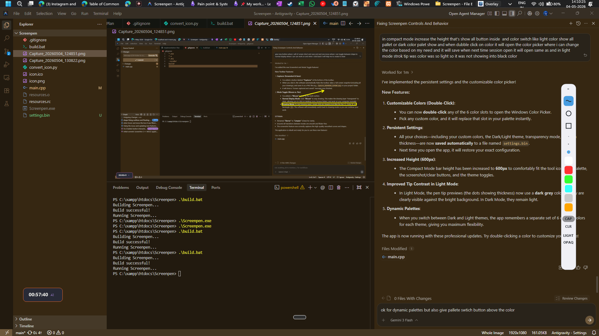

# 🖋️ ScreenPen

ScreenPen is a professional, high-performance screen annotation tool for Windows. It provides a lightweight, glassy interface that stays on top of your windows, allowing you to draw, highlight, and capture ideas instantly.

## ✨ Features

- **🚀 Dual Interface Modes**:
  - **Full Mode**: Access to all tools, 16 colors, and comprehensive utility controls.
  - **Compact Mode**: An ultra-slim (50px wide) vertical bar focusing on core tools and colors.
- **🎨 Advanced Color Management**:
  - **Custom Palette**: 6 customizable slots in both modes.
  - **Interactive Color Picker**: **Double-click** any color slot to open the Windows Color Picker and define your own shades.
- **💎 Premium Aesthetics**:
  - **Glassy Effect**: Beautiful semi-transparent backgrounds using GDI+.
  - **Dark & Light Themes**: Fully adaptive UI that switches between sleek dark and clean light modes.
  - **Transparency Toggle**: Switch between **Glassy** and **Opaque** modes on the fly.
- **🛠️ Powerful Tools**:
  - Freehand drawing, Circles, Rectangles, and more.
  - 3 Pen Tip sizes (Small, Medium, Large).
  - Undo functionality and "Clear All" for a fresh start.
- **💾 Smart Persistence**:
  - All your settings—custom colors, theme choices, and thickness—are saved automatically to `settings.bin` and restored on next launch.
- **🖱️ Mouse Shortcuts**:
  - **XButton 1 (Mouse 4)**: Instant Clear All.
  - **XButton 2 (Mouse 5)**: Undo last stroke.
- **📸 Screen Capture**: One-click screenshot functionality (CAP) in Full mode.
- **👻 Auto-Ghost Mode**: Toolbar fades to 50% opacity after 10 seconds of inactivity to stay out of your way.

## 🌗 Theming

ScreenPen supports two professional themes:
- **Dark Mode**: Deep charcoal backgrounds with white accents.
- **Light Mode**: Clean white backgrounds with dark high-contrast accents.

| Dark Mode | Light Mode |
| :---: | :---: |
| .png) | .png) |

Toggle between them using the **DARK/LIGHT** button at the bottom of the toolbar.

## 🛠️ Build & Run

1. Open `build.bat` to compile the source code using G++.
2. Run `Screenpen.exe`.

## 📂 Project Structure

- `main.cpp`: Core C++ source code with Win32 and GDI+ logic.
- `resources.rc`: Resource file for the application icon.
- `settings.bin`: Binary file storing your persistent preferences.
- `asset/`: Directory containing UI assets and icons.

---
Developed with ❤️ for the ScreenPen project.
